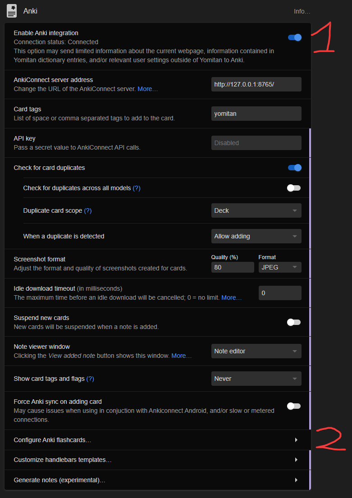

import Tabs from '@theme/Tabs';
import TabItem from '@theme/TabItem';

# Anki/Yomitan Setup

## 1. Install AnkiConnect

In Anki

1. Tools -> Addons -> Get Addons...
2. Install [AnkiConnect](https://ankiweb.net/shared/info/2055492159) by pasting `2055492159` and clicking OK.
3. Restart Anki

### 2. Set Yomitan to Use AnkiConnect

Open Yomitan settings:

1. `Anki` -> `Enable Anki Integration`
2. `Configure Anki Flashcards`



## 3. Setup Anki Note Type

:::info Note
It is not required to use these specific note types, these are just my personal recommendations based on experience and community feedback. You can use any Anki note type you prefer, as long as you map the fields correctly in Yomitan, and GSM.

If you want something simple, Lapis is a great choice. If you want something more advanced with more features, Kiku is excellent.
:::

<Tabs queryString="notetype">

  <TabItem value="kiku" label="Kiku">
    
    ## Kiku Setup

    Kiku is a very new note type and is rapidly evolving. I've moved to using Kiku as my primary note type due to its rich feature set and active development. Below are the recommended Yomitan field mappings for Kiku.

    

    ### 1. Installation
    
    1. Download the latest release `Kiku_v*.apkg` from [GitHub Releases](https://github.com/youyoumu/kiku/releases/latest).
    2. Double-click the file to import it into Anki.
    3. The `Kiku` notetype should now be available in your **Note Types** list.

    ### 2. Note Manager (Optional)
    
    The **Kiku Note Manager** addon is recommended to generate a notes cache so the Kanji View feature works across all platforms.
    
    1. Install the [Kiku Note Manager Addon](https://ankiweb.net/shared/info/408592650?cb=1763445474367).
    2. Go to `Tools` > `Kiku Note Manager` > `Generate notes cache`.

    ### 3. Yomitan Fields
    
    Open Yomitan settings, go to `Anki` > `Configure Anki flashcard`, select `Kiku` as the Model.

    | Field | Value |
    | :--- | :--- |
    | **Expression** | `{expression}` |
    | **ExpressionFurigana** | `{furigana-plain}` |
    | **ExpressionReading** | `{reading}` |
    | **ExpressionAudio** | `{audio}` |
    | **SelectionText** | `{popup-selection-text}` |
    | **MainDefinition** | `{single-glossary-jmdict/jitendex}` <br/> *Click the down arrow next to this field to find your specific dictionary.* |
    | **DefinitionPicture** | *Leave empty (or use for manual images)* |
    | **Sentence** | `{cloze-prefix}<b>{cloze-body}</b>{cloze-suffix}` |
    | **SentenceFurigana** | |
    | **SentenceAudio** | |
    | **Picture** | |
    | **Glossary** | `{glossary}` |
    | **Hint** | |
    | **PitchPosition** | `{pitch-accent-positions}` |
    | **PitchCategories** | `{pitch-accent-categories}` |
    | **Frequency** | `{frequencies}` |
    | **FreqSort** | `{frequency-harmonic-rank}` |
    | **MiscInfo** | `{document-title}` |

  </TabItem>

  <TabItem value="lapis" label="Lapis">

    <!-- <div style={{margin: '0 0 1rem 0'}}>
    
    </div> -->

    ## Lapis Setup

    I used to use Lapis, and it remains a solid choice for it's simplicity and ease of use. Below are the recommended Yomitan field mappings for Lapis.

    

    ### 1. Installation
    
    1. Download the example deck from [Lapis Releases](https://github.com/donkuri/lapis/releases).
    2. Import the deck into Anki.

    ### 2. Yomitan Fields
    
    Select `Lapis` as the **Model** in Yomitan's `Configure Anki Card Format`.

    :::tip Definition Field
    In `MainDefinition`, what you get will depend on the version of JMdict or Jitendex you have. If you decide you do not want to use any bilingual dictionary, simply use your main monolingual dictionary there.
    :::

    :::warning Sentence Furigana
    Ensure that the `SentenceFurigana` field is empty. We strongly recommend **against** using the `{sentence-furigana}` handlebar as it breaks bold formatting.
    :::

    | Field | Value |
    | :--- | :--- |
    | **Expression** | `{expression}` |
    | **ExpressionFurigana** | `{furigana-plain}` |
    | **ExpressionReading** | `{reading}` |
    | **ExpressionAudio** | `{audio}` |
    | **SelectionText** | `{popup-selection-text}` |
    | **MainDefinition** | `{single-glossary-jmdict/jitendex}` |
    | **DefinitionPicture** | *Leave empty (or use for manual images)* |
    | **Sentence** | `{cloze-prefix}<b>{cloze-body}</b>{cloze-suffix}` |
    | **SentenceFurigana** | |
    | **SentenceAudio** | |
    | **Picture** | |
    | **Glossary** | `{glossary}` |
    | **Hint** | |
    | **PitchPosition** | `{pitch-accent-positions}` |
    | **PitchCategories** | `{pitch-accent-categories}` |
    | **Frequency** | `{frequencies}` |
    | **FreqSort** | `{frequency-harmonic-rank}` |
    | **MiscInfo** | `{document-title}` |

  </TabItem>

  <TabItem value="senren" label="Senren">

    <!-- <div style={{margin: '0 0 1rem 0'}}>
    <video src="/img/senren.mp4" controls style={{maxWidth: '100%', height: 'auto', display: 'block', margin: '0 auto'}}></video>
    </div> -->

    ## Senren Setup

    Senren is a very attractive option based on looks alone. I have never used Senren, so I can't offer support beyond this setup guide, which is directly from the Senren documentation.

    

    ### 1. Yomitan Fields
    
    In Yomitan Settings -> Anki -> Configure Anki Flashcards:

    | Field | Value | Notes |
    | :--- | :--- | :--- |
    | **word** | `{expression}` | |
    | **sentence** | `<span class="group">{cloze-prefix}<span class="highlight">{cloze-body}</span>{cloze-suffix}</span>` | |
    | **sentenceFurigana** | `<span class="group">{sentence-furigana}</span>` | |
    | **sentenceEng** | | Leave empty. |
    | **reading** | `{pitch-accents}` | |
    | **sentenceCard** | | Leave empty. |
    | **audioCard** | | Leave empty. |
    | **notes** | | Leave empty. |
    | **selectionText** | `{popup-selection-text}` | |
    | **definition** | `{single-glossary-jitendexorg-2025-04-11}` | Set your primary dictionary here. |
    | **wordAudio** | `{audio}` | |
    | **sentenceAudio** | | Leave empty. |
    | **picture** | `{clipboard-image}` | |
    | **glossary** | `{glossary}` | Enables extraction from all active dictionaries. |
    | **pitchPosition** | `{pitch-accent-positions}` | |
    | **pitch** | `{pitch-accent-categories}` | |
    | **frequency** | `{frequencies}` | |
    | **freqSort** | `{frequency-harmonic-rank}` | |
    | **miscInfo** | `{document-title}` | |
    | **dictionaryPreference** | | Enter `glossary` to show the glossary first, or specific dictionary names to prioritize them. |

    ### 2. Yomitan Handlebars (Optional)

    1. Go to **Yomitan Settings** -> **Anki** -> **Configure Anki card Templates...**
    2. Replace the code with the following:

    <details>
      <summary>Click to expand required Handlebars code</summary>

    ```handlebars
    {{#*inline "glossary-single"}}
        {{~#unless brief~}}
            {{~#scope~}}
                {{~set "any" false~}}
                {{~#each definitionTags~}}
                    {{~#if (op "||" (op "!" @root.compactTags) (op "!" redundant))~}}
                        {{~#if (get "any")}}, {{else}}<i>({{/if~}}
                        {{name}}
                        {{~set "any" true~}}
                    {{~/if~}}
                {{~/each~}}
                {{~#unless noDictionaryTag~}}
                    {{~#if (op "||" (op "!" @root.compactTags) (op "!==" dictionary (get "previousDictionary")))~}}
                        {{~#if (get "any")}}, {{else}}<i>({{/if~}}
                        {{dictionaryAlias}}
                        {{~set "any" true~}}
                    {{~/if~}}
                {{~/unless~}}
                {{~#if (get "any")}})</i> {{/if~}}
            {{~/scope~}}
            {{~#if only~}}({{#each only}}{{.}}{{#unless @last}}, {{/unless}}{{/each}} only) {{/if~}}
        {{~/unless~}}
        {{~#if (op "<=" glossary.length 1)~}}
            {{#each glossary}}{{formatGlossary ../dictionary .}}{{/each}}
        {{~else if @root.compactGlossaries~}}
            {{#each glossary}}{{formatGlossary ../dictionary .}}{{#unless @last}} | {{/unless}}{{/each}}
        {{~else~}}
            <ul>{{#each glossary}}<li>{{formatGlossary ../dictionary .}}</li>{{/each}}</ul>
        {{~/if~}}
        {{~set "previousDictionary" dictionary~}}
    {{/inline}}
    
    {{#*inline "audio"}}
        {{~#if (hasMedia "audio")~}}
            [sound:{{getMedia "audio"}}]
        {{~/if~}}
    {{/inline}}
    
    {{#*inline "character"}}
        {{~definition.character~}}
    {{/inline}}
    
    {{#*inline "dictionary"}}
        {{~definition.dictionary~}}
    {{/inline}}
    
    {{#*inline "dictionary-alias"}}
        {{~definition.dictionaryAlias~}}
    {{/inline}}
    
    {{#*inline "expression"}}
        {{~#if merge~}}
            {{~#each definition.expression~}}
                {{{.}}}
                {{~#unless @last}}、{{/unless~}}
            {{~/each~}}
        {{~else~}}
            {{definition.expression}}
        {{~/if~}}
    {{/inline}}
    
    {{#*inline "furigana"}}
        {{~#if merge~}}
            {{~#each definition.expressions~}}
                <span class="expression-{{termFrequency}}">{{~furigana .~}}</span>
                {{~#unless @last}}、{{/unless~}}
            {{~/each~}}
        {{~else~}}
            {{furigana definition}}
        {{~/if~}}
    {{/inline}}
    
    {{#*inline "furigana-plain"}}
        {{~#if merge~}}
            {{~#each definition.expressions~}}
                <span class="expression-{{termFrequency}}">{{~furiganaPlain .~}}</span>
                {{~#unless @last}}、{{/unless~}}
            {{~/each~}}
        {{~else~}}
            {{furiganaPlain definition}}
        {{~/if~}}
    {{/inline}}
    
    {{~#*inline "glossary"~}}
        <div style="text-align: left;" class="yomitan-glossary">
        {{~#scope~}}
            {{~#if (op "===" definition.type "term")~}}
                {{~#unless (op "&&" selectedDictionary (op "!=" selectedDictionary definition.dictionary))~}}
                    {{~> glossary-single definition brief=brief noDictionaryTag=noDictionaryTag ~}}
                    {{~#if definition.glossaryScopedStyles~}}
                        <style>{{{definition.glossaryScopedStyles}}}</style>
                    {{~/if~}}
                {{~/unless~}}
            {{~else if (op "||" (op "===" definition.type "termGrouped") (op "===" definition.type "termMerged"))~}}
                <ol>
                    {{~#each definition.definitions~}}
                        {{~#unless (op "&&" ../selectedDictionary (op "!=" ../selectedDictionary dictionary))~}}
                            <li data-dictionary="{{dictionary}}">
                                {{~> glossary-single . brief=../brief noDictionaryTag=../noDictionaryTag ~}}
                            </li>
                            {{~#if dictScopedStyles~}}
                                <style>{{{dictScopedStyles}}}</style>
                            {{~/if~}}
                        {{~/unless~}}
                    {{~/each~}}
                </ol>
            {{~else if (op "===" definition.type "kanji")~}}
                {{~#if (op ">" definition.glossary.length 1)~}}
                    <ol>{{#each definition.glossary}}<li>{{.}}</li>{{/each}}</ol>
                {{~else~}}
                    {{~#each definition.glossary~}}{{.}}{{~/each~}}
                {{~/if~}}
            {{~/if~}}
        {{~/scope~}}
        </div>
    {{~/inline~}}
    
    {{#*inline "glossary-no-dictionary"}}
        {{~> glossary noDictionaryTag=true ~}}
    {{/inline}}
    
    {{#*inline "glossary-brief"}}
        {{~> glossary brief=true ~}}
    {{/inline}}
    
    {{~#*inline "glossary-plain"~}}
        {{~#scope~}}
            {{~#each definition.definitions~}}
                {{~#unless (op "&&" ../selectedDictionary (op "!=" ../selectedDictionary dictionary))~}}
                    {{~#unless ../noDictionaryTag~}}
                        ({{dictionaryAlias}})<br>
                    {{~/unless~}}
                    {{#each glossary}}{{{formatGlossaryPlain ../dictionary .}}}{{#unless @last}}<br>{{/unless}}{{/each}}{{#unless @last}}<br>{{/unless}}
                {{~/unless~}}
            {{~/each~}}
        {{~/scope~}}
    {{~/inline~}}
    
    {{#*inline "glossary-plain-no-dictionary"~}}
        {{~> glossary-plain noDictionaryTag=true ~}}
    {{/inline}}
    
    {{~#*inline "glossary-first"~}}
        <div style="text-align: left;" class="yomitan-glossary">
        {{~#scope~}}
            {{~#if (op "===" definition.type "term")~}}
                {{~> glossary-single definition brief=brief noDictionaryTag=noDictionaryTag ~}}
                {{~#if definition.glossaryScopedStyles~}}
                    <style>{{{definition.glossaryScopedStyles}}}</style>
                {{~/if~}}
            {{~else if (op "||" (op "===" definition.type "termGrouped") (op "===" definition.type "termMerged"))~}}
                {{~#if (op ">" definition.definitions.length 1)~}}
                    {{~#with definition.definitions.[0]~}}
                        {{~> glossary-single . brief=../brief noDictionaryTag=../noDictionaryTag ~}}
                        {{~#if glossaryScopedStyles~}}
                            <style>{{{glossaryScopedStyles}}}</style>
                        {{~/if~}}
                    {{~/with~}}
                {{~else~}}
                    {{~#with definition.definitions.[0]~}}
                        {{~> glossary-single . brief=../brief noDictionaryTag=../noDictionaryTag ~}}
                        {{~#if glossaryScopedStyles~}}
                            <style>{{{glossaryScopedStyles}}}</style>
                        {{~/if~}}
                    {{~/with~}}
                {{~/if~}}
            {{~/if~}}
        {{~/scope~}}
        </div>
    {{~/inline~}}
    
    {{#*inline "glossary-first-no-dictionary"}}
        {{~> glossary-first noDictionaryTag=true ~}}
    {{/inline}}
    
    {{#*inline "glossary-first-brief"}}
        {{~> glossary-first brief=true ~}}
    {{/inline}}
    
    {{#*inline "kunyomi"}}
        {{~#each definition.kunyomi}}{{.}}{{#unless @last}}, {{/unless}}{{/each~}}
    {{/inline}}
    
    {{#*inline "onyomi"}}
        {{~#each definition.onyomi}}{{.}}{{#unless @last}}, {{/unless}}{{/each~}}
    {{/inline}}
    
    {{#*inline "onyomi-hiragana"}}
        {{~#each definition.onyomi}}{{hiragana .}}{{#unless @last}}, {{/unless}}{{/each~}}
    {{/inline}}
    
    {{#*inline "reading"}}
        {{~#if merge~}}
            {{~#each definition.reading~}}
                {{{.}}}
                {{~#unless @last}}、{{/unless~}}
            {{~/each~}}
        {{~else~}}
            {{~definition.reading~}}
        {{~/if~}}
    {{/inline}}
    
    {{#*inline "sentence"}}
        {{~#if definition.cloze}}{{{definition.cloze.sentence}}}{{/if~}}
    {{/inline}}
    
    {{#*inline "cloze-prefix"}}
        {{~#if definition.cloze}}{{{definition.cloze.prefix}}}{{/if~}}
    {{/inline}}
    
    {{#*inline "cloze-body"}}
        {{~#if definition.cloze}}{{{definition.cloze.body}}}{{/if~}}
    {{/inline}}
    
    {{#*inline "cloze-body-kana"}}
        {{~#if definition.cloze}}{{{definition.cloze.bodyKana}}}{{/if~}}
    {{/inline}}
    
    {{#*inline "cloze-suffix"}}
        {{~#if definition.cloze}}{{{definition.cloze.suffix}}}{{/if~}}
    {{/inline}}
    
    {{#*inline "tags"}}
        {{~#mergeTags definition group merge}}{{this}}{{/mergeTags~}}
    {{/inline}}
    
    {{~#*inline "url"~}}
        <a href="{{definition.url}}">{{definition.url}}</a>
    {{~/inline~}}
    
    {{#*inline "screenshot"}}
        {{~#if (hasMedia "screenshot")~}}
            
        {{~/if~}}
    {{/inline}}
    
    {{#*inline "document-title"}}
        {{~context.document.title~}}
    {{/inline}}
    
    {{! Pitch Accents }}
    {{#*inline "pitch-accent-item"}}
        {{~pronunciation format=format reading=reading pitchPositions=positions nasalPositions=nasalPositions devoicePositions=devoicePositions~}}
    {{/inline}}
    
    {{#*inline "pitch-accent-item-disambiguation"}}
        {{~#scope~}}
            {{~set "exclusive" (spread exclusiveExpressions exclusiveReadings)~}}
            {{~#if (op ">" (property (get "exclusive") "length") 0)~}}
                {{~set "separator" ""~}}
                <em>({{#each (get "exclusive")~}}
                    {{~get "separator"~}}{{{.}}}
                {{~/each}} only) </em>
            {{~/if~}}
        {{~/scope~}}
    {{/inline}}
    
    {{#*inline "pitch-accent-list"}}
        {{~#if (op ">" pitchCount 0)~}}
            {{~#if (op ">" pitchCount 1)~}}<ol>{{~/if~}}
            {{~#each pitches~}}
                {{~#each pitches~}}
                    {{~#if (op ">" ../../pitchCount 1)~}}<li>{{~/if~}}
                        {{~> pitch-accent-item-disambiguation~}}
                        {{~> pitch-accent-item format=../../format~}}
                    {{~#if (op ">" ../../pitchCount 1)~}}</li>{{~/if~}}
                {{~/each~}}
            {{~/each~}}
            {{~#if (op ">" pitchCount 1)~}}</ol>{{~/if~}}
        {{~/if~}}
    {{/inline}}
    
    {{#*inline "pitch-accents"}}
        {{#if (op ">" pitchCount 0)}}
            {{~> pitch-accent-list format='text'~}}
        {{else}}
            {{~definition.reading~}}
        {{/if}}
    {{/inline}}
    
    {{#*inline "pitch-accent-graphs"}}
        {{~> pitch-accent-list format='graph'~}}
    {{/inline}}
    
    {{#*inline "pitch-accent-graphs-jj"}}
        {{~> pitch-accent-list format='graph-jj'~}}
    {{/inline}}
    
    {{#*inline "pitch-accent-positions"}}
        {{~> pitch-accent-list format='position'~}}
    {{/inline}}
    
    {{~#*inline "pitch-accent-categories"~}}
        {{~#each (pitchCategories @root)~}}{{~.~}}{{~#unless @last~}},{{~/unless~}}{{~/each~}}
    {{~/inline~}}
    {{! End Pitch Accents }}
    
    {{#*inline "phonetic-transcriptions"}}
        {{~#if (op ">" definition.phoneticTranscriptions.length 0)~}}
            <ul>
                {{~#each definition.phoneticTranscriptions~}}
                    {{~#each phoneticTranscriptions~}}
                        <li class="pronunciation" data-pronunciation-type="phonetic-transcription">
                            {{~set "any" false~}}
                            {{~#each tags~}}
                                {{~#if (get "any")}}, {{else}}<i>({{/if~}}
                                <span class="tag" data-details="{{name}}">{{name}}</span>
                                {{~set "any" true~}}
                            {{~/each~}}
                            {{~#if (get "any")}})</i> {{/if~}}
                            {{ipa~}}
                        </li>
                    {{~/each~}}
                {{~/each~}}
            </ul>
        {{~/if~}}
    {{/inline}}
    
    {{#*inline "clipboard-image"}}
        {{~#if (hasMedia "clipboardImage")~}}
            
        {{~/if~}}
    {{/inline}}
    
    {{#*inline "clipboard-text"}}
        {{~#if (hasMedia "clipboardText")}}{{{getMedia "clipboardText"}}}{{/if~}}
    {{/inline}}
    
    {{#*inline "conjugation"}}
        {{~#if (op ">" definition.inflectionRuleChainCandidates.length 0)~}}
            {{~set "multiple" false~}}
            {{~#if (op ">" definition.inflectionRuleChainCandidates.length 1)~}}
                {{~set "multiple" true~}}
            {{~/if~}}
            {{~#if (get "multiple")~}}<ul>{{/if~}}
                {{~#each definition.inflectionRuleChainCandidates~}}
                    {{~#if (op ">" inflectionRules.length 0)~}}
                        {{~#if (get "multiple")~}}<li>{{/if~}}
                        {{~#each inflectionRules~}}
                            {{~#if (op ">" @index 0)}} « {{/if~}}
                            {{name}}
                        {{~/each~}}
                        {{~#if (get "multiple")~}}</li>{{/if~}}
                    {{~/if~}}
                {{~/each~}}
            {{~#if (get "multiple")~}}</ul>{{/if~}}
        {{~/if~}}
    {{/inline}}
    
    {{#*inline "frequencies"}}
        {{~#if (op ">" definition.frequencies.length 0)~}}
            <ul style="text-align: left;">
            {{~#each definition.frequencies~}}
                {{~#unless (op "&&" ../selectedDictionary (op "!=" ../selectedDictionary dictionary))~}}
                    <li>
                    {{~#if (op "!==" ../definition.type "kanji")~}}
                        {{~#if (op "||" (op ">" ../uniqueExpressions.length 1) (op ">" ../uniqueReadings.length 1))~}}(
                            {{~furigana expression reading~}}
                        ) {{/if~}}
                    {{~/if~}}
                    {{~dictionaryAlias}}: {{frequency~}}
                    </li>
                {{~/unless~}}
            {{~/each~}}
            </ul>
        {{~/if~}}
    {{/inline}}
    
    {{#*inline "single-frequency-number"}}
        {{~#if (op ">" definition.frequencyNumbers.length 0)~}}
            {{~#each definition.frequencyNumbers~}}
                {{~#unless (op "&&" ../selectedDictionary (op "!=" ../selectedDictionary dictionary))~}}
                        {{frequency~}}
                {{~/unless~}}
            {{~/each~}}
        {{/if}}
    {{/inline}}
    
    {{#*inline "frequency-harmonic-rank"}}
        {{~#if (op "===" definition.frequencyHarmonic -1) ~}}
            9999999
        {{~else ~}}
            {{definition.frequencyHarmonic}}
        {{~/if~}}
    {{/inline}}
    
    {{#*inline "frequency-harmonic-occurrence"}}
        {{~#if (op "===" definition.frequencyHarmonic -1) ~}}
            0
        {{~else ~}}
            {{definition.frequencyHarmonic}}
        {{~/if~}}
    {{/inline}}
    
    {{#*inline "frequency-average-rank"}}
        {{~#if (op "===" definition.frequencyAverage -1) ~}}
            9999999
        {{~else ~}}
            {{definition.frequencyAverage}}
        {{~/if~}}
    {{/inline}}
    
    {{#*inline "frequency-average-occurrence"}}
        {{~#if (op "===" definition.frequencyAverage -1) ~}}
            0
        {{~else ~}}
            {{definition.frequencyAverage}}
        {{~/if~}}
    {{/inline}}
    
    {{#*inline "stroke-count"}}
        {{~#scope~}}
            {{~set "found" false~}}
            {{~#each definition.stats.misc~}}
                {{~#if (op "===" name "strokes")~}}
                    {{~set "found" true~}}
                    Stroke count: {{value}}
                {{~/if~}}
            {{~/each~}}
            {{~#if (op "!" (get "found"))~}}
                Stroke count: Unknown
            {{~/if~}}
        {{~/scope~}}
    {{/inline}}
    
    {{#*inline "part-of-speech-pretty"}}
        {{~#if (op "===" . "v1")~}}Ichidan verb
        {{~else if (op "===" . "v5")~}}Godan verb
        {{~else if (op "===" . "vk")~}}Kuru verb
        {{~else if (op "===" . "vs")~}}Suru verb
        {{~else if (op "===" . "vz")~}}Zuru verb
        {{~else if (op "===" . "adj-i")~}}I-adjective
        {{~else if (op "===" . "n")~}}Noun
        {{~else~}}{{.}}
        {{~/if~}}
    {{/inline}}
    
    {{#*inline "part-of-speech"}}
        {{~#scope~}}
            {{~#if (op "!==" definition.type "kanji")~}}
                {{~set "first" true~}}
                {{~#each definition.expressions~}}
                    {{~#each wordClasses~}}
                        {{~#unless (get (concat "used_" .))~}}
                            {{~> part-of-speech-pretty . ~}}
                            {{~#unless (get "first")}}, {{/unless~}}
                            {{~set (concat "used_" .) true~}}
                            {{~set "first" false~}}
                        {{~/unless~}}
                    {{~/each~}}
                {{~/each~}}
                {{~#if (get "first")~}}Unknown{{~/if~}}
            {{~/if~}}
        {{~/scope~}}
    {{/inline}}
    
    {{#*inline "search-query"}}
        {{~#multiLine}}{{context.fullQuery}}{{/multiLine~}}
    {{/inline}}
    
    {{#*inline "popup-selection-text"}}
        {{~#if (hasMedia "popupSelectionText")}}{{{getMedia "popupSelectionText"}}}{{/if~}}
    {{/inline}}
    
    {{#*inline "sentence-furigana"}}
        {{~#if definition.cloze~}}
            {{~#if (hasMedia "textFurigana" definition.cloze.sentence)~}}
                {{{getMedia "textFurigana" definition.cloze.sentence escape=false}}}
            {{~else~}}
                {{{definition.cloze.sentence}}}
            {{~/if~}}
        {{~/if~}}
    {{/inline}}
    
    {{#*inline "sentence-furigana-plain"}}
        {{~#if definition.cloze~}}
            {{~#if (hasMedia "textFuriganaPlain" definition.cloze.sentence)~}}
                {{{getMedia "textFuriganaPlain" definition.cloze.sentence escape=false}}}
            {{~else~}}
                {{{definition.cloze.sentence}}}
            {{~/if~}}
        {{~/if~}}
    {{/inline}}
    
    {{~> (lookup . "marker") ~}}
    ```
    </details>

    ### 3. Result Display
    
    For the `glossary` field to populate correctly with multiple dictionaries, you must enable grouping:

    *   **Settings** -> **Appearance** -> **Result Display**
    *   Select **Group term-reading pairs** OR **Group related terms**.

  </TabItem>

</Tabs>